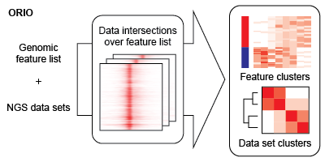
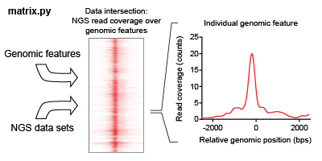
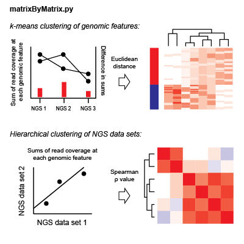

ORIO: Online Resource for Integrative Omics
===========================================

ORIO (Online Resource for Integrative Omics) is an analysis platform for
data from next generation sequencing (NGS). ORIO enables rapid analysis
and integration of NGS data sets. ORIO was designed based on three
central observations:

1. Diverse biological phenomena may be represented by discrete positions
   in genomic space. Think protein binding sites for transcription
   factor regulation or transcription start sites for transcription
   initiation.
2. Despite a wide diversity of NGS experiment and data types, analysis
   of NGS data often involves consideration and manipulation of genomic
   read coverage.
3. Visual inspection remains a critical component of analysis.

ORIO enables analysis of multiple NGS datasets considering a feature list of
discrete genomic coordinates.  The results of this analysis may be dynamically
displayed using the tools present in the companion `ORIO-web`_ framework.

.. _`ORIO-web`: https://github.com/niehs/orio-web

Main functions
--------------

An ORIO analysis run consists of two steps. First, the intersections
between a feature list of genomic coordinates and a number of NGS data
sets is performed. Second, the NGS data sets are correlated based on
these intersection values. The output of these steps may be dynamically
visualized using `ORIO-web`_.

.. _`ORIO-web`: https://github.com/niehs/orio-web

``matrix.py``
~~~~~~~~~~~~~

matrix.py finds the intersection of a feature list of genomic
coordinates and a NGS data set. This intersection describes the overlap
of read coverage from the NGS data across genomic windows anchored on
feature list positions.

::

    python matrix.py [OPTIONS] BIGWIGS FEATURE_BED OUTPUT_MATRIX

Required arguments
''''''''''''''''''

``BIGWIGS``

    ``matrix.py`` requires read coverage of a NGS data set in bigWig format.
    ``matrix.py`` calls ``bigWigAverageOverBed`` from the UCSC kentUtils package. If
    the ``--stranded_bigwgs`` flag is set, two bigWig files are required.
    The first bigWig file must correspond to read coverage on the ‘plus’
    strand; the second must correspond to the ‘minus’ strand. If the
    ``--stranded_bigwigs`` flag is not used, a single bigWig file is
    required.

``FEATURE_BED``

    Genomic windows are generated about entries in a standard BED file. If
    the ``--stranded_bed`` flag is used, the BED file must have at least six
    columns per entry.

Optional arguments
''''''''''''''''''

``-a, --anchor`` [start | end | center]

``-b, --bin_start`` INTEGER (Default: -2500)

``-n, --bin_number`` INTEGER (Default: 50)

``-s, --bin_size`` INTEGER (Default: 100)

    ``anchor``, ``bin_start``, ``bin_number``, and ``bin_size`` are used to specify the
    genomic windows created about each genomic feature in the input BED
    file.

    ``anchor`` sets the anchor point for each BED range at range start, end, or
    center, observing entry strandedness (‘start’ is taken as the highest
    value of the range for entries on the ‘minus’ strand).

    ``bin_start`` specifies where the genomic window starts; negative values
    place the starting position upstream.

    ``bin_number`` specifies the number of bins used in the genomic window.
    These bins are considered during generation of output matrix files.

    ``bin_size`` specifies the size of each bin. Currently, bins must be the
    same size.

``--opposite_strand_fn`` FILENAME

    If specified, read coverage values for the opposite strand of BED
    entries are used to generate a separate opposite-strand matrix file.
    This file uses the same bins and windows as the ‘same-strand’
    ``OUTPUT_MATRIX``.

``--stranded_bigwigs``

    If specified, strand-specific read coverage bigWigs are expected.

``--stranded_bed``

    If specified, a stranded BED file is expected. The output matrix file is
    then generated informed by strand. In these stranded matrix files, more
    downstream positions are represented by higher positive values.

Output
''''''

``OUTPUT_MATRIX``

    The output matrix file gives read coverage over features in the
    ``FEATURE_BED`` file considering coverage in the input ``BIGWIGS`` file(s).
    Coverage is reported in bins set by the user-defined parameters. The
    first line of ``OUTPUT_MATRIX`` is a header describing the bins. The
    positions given for each bin are relative to the anchor point set by
    ``-a, --anchor``. Each row of the matrix corresponds to an individual
    feature in ``FEATURE_BED``. Read coverage values are reported as sums in
    each bin. In a strand-specific analysis, read coverage in the opposite
    strand may be found using ``--opposite_strand_fn FILENAME``.

``matrixByMatrix.py``
~~~~~~~~~~~~~~~~~~~~~

Considering matrix files generated by ``matrix.py``,
``matrixByMatrix.py`` finds correlation values between NGS data sets.
``matrixByMatrix.py`` clusters NGS data sets on the basis of these
correlation values. Clustering is also performed on genomic features
based on relative enrichment of individual NGS data sets.

::

    python matrixByMatrix.py [OPTIONS] MATRIX_LIST_FN WINDOW_START BIN_NUMBER BIN_SIZE OUTPUT_JSON

Required arguments
''''''''''''''''''

``MATRIX_LIST_FN``

    The matrix files generated by ``matrix.py`` to be analyzed by
    ``matrixByMatrix.py`` are described in tab-delimited file
    ``MATRIX_LIST_FN``. Each row in the file corresponds to an individual
    matrix file. In each row, the following information is given in order:

    ::

        MATRIX_ID    DISPLAY_NAME    FILE_PATH

    ``FILE_PATH`` gives the path to the associated matrix file.
    ``MATRIX_ID`` and ``DISPLAY_NAME`` are principally used to annotate the
    ``OUTPUT_JSON`` for visualization in `ORIO-web`_.

    .. _ORIO-web: https://github.com/shapiromatron/orio-web

``WINDOW_START``

``BIN_NUMBER``

``BIN_SIZE``

    ``WINDOW_START``, ``BIN_NUMBER``, and ``BIN_SIZE`` specify the
    dimensions of the genomic window used in creating the read coverage
    matrix files. These values should be consistent with the parameters used
    with ``matrix.py``.

``OUTPUT_JSON``

    Results of the clustering analysis are reported in ``OUTPUT_JSON``.
    These results are designed for visualization in `ORIO-web`_.

    .. _ORIO-web: https://github.com/shapiromatron/orio-web

Optional arguments
''''''''''''''''''

``--sort_vector SORT_VECTOR_FN``

    If a sort vector is specified by ``--sort_vector``, correlations are
    considering a user-defined sort vector. The sort vector provides an
    individual value for each genomic feature and has the following format:

    ::

        FEATURE_ENTRY   ENTRY_VALUE

    When a sort vector is used, ``matrixByMatrix.py`` finds the pairwise
    correlations between the sort vector and each matrix file specified in
    ``MATRIX_LIST_FN``. Correlation values are found between sort vector
    values and read coverage sums in each bin. These correlation values are
    then used to hierarchically cluster NGS data sets.

Main functions
--------------

An ORIO analysis run consists of two steps. First, the intersections
between a feature list of genomic coordinates and a number of NGS data
sets is performed. Second, the NGS data sets are correlated based on
these intersection values. The output of these steps may be dynamically
visualized using ORIO-web.

matrix.py
~~~~~~~~~

matrix.py finds the intersection of a feature list of genomic
coordinates and a NGS data set. This intersection describes the overlap
of read coverage from the NGS data across genomic windows anchored on
feature list positions.

::

    python matrix.py [OPTIONS] BIGWIGS FEATURE_BED OUTPUT_MATRIX

Developing notes:
=================

To install in `development mode`_, use the command in the root path of the
development environment::

    pip install -e .

.. _`development mode`: https://pip.pypa.io/en/stable/reference/pip_install/#cmdoption-e
